# Corner Grocery Application

## The Original Project
<details>
<summary>Click here to collapse/expand this section</summary>

### The Goal:
The final project for CS 210 - Programming Languages, a course that taught basic file and class structures using languages such as C++. The premise of the final project is as follows:
>"Your task is to build an item-tracking program for the Corner Grocer, which should incorporate all of their requested functionality. The Corner Grocer needs a program that analyzes the text records they generate throughout the day. These records list items purchased in chronological order from the time the store opens to the time it closes. They are interested in rearranging their produce section and need to know how often items are purchased so they can create the most effective layout for their customers."

The file given was a basic .txt file with the item names written, separated by line, in order that they were purchased. An example is below:
```
Spinach
Radishes
Broccoli
Peas
Cranberries
Broccoli
```
From this snippet, we can see that there are two listings for Broccoli, so Broccoli should have a count of two so far. 


### The Artifact:
The artifact was a simple C++ application that ran in a terminal window. It included four options, chosen by typing a number and pressing enter: display a single item's count, display all items and their counts, display all items and their counts as a histogram, and exit.

<p align="center">
    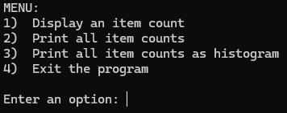
</p>

When options two and three are selected:

<p align="center">
    
    
</p>
<br><br>

### The Code Review
Clicking on the thumbnail below will take you to the video hosted on Youtube:

<div align="center">
  
[](https://www.youtube.com/watch?v=Jh8hhmw8C44)

</div>

</details>

<br>

## Enhancement One - Software Design & Engineering

### The Goal:
To demonstrate competency in the course outcomes for CS 499 - Computer Science Capstone, I wanted to take the original artifact and demonstrate an ability to adapt it to other languages and systems, and to improve upon its functionality. To that end, the goal was to take the original artifact and recreate it as a fully-fledged Android application, using best practices and demonstrating an eye for user interface and user experience design, as well as an understanding of how to develop it to be update-friendly should new features be requested. As such, the final version should incorporate a large change of aesthetics including implementation of a graphical user interface, as well as implementations of new data structures, algorithms, engineering, and a SQLite database.


### The Process
To begin the enhancements, I first considered the requirements of the project, and then began to work on ways in which the enhancements could be demonstrated. Part of this process was creating a simple mockup so that I could lay out key ideas and gain a basic visual guideline.
<p align="center">
    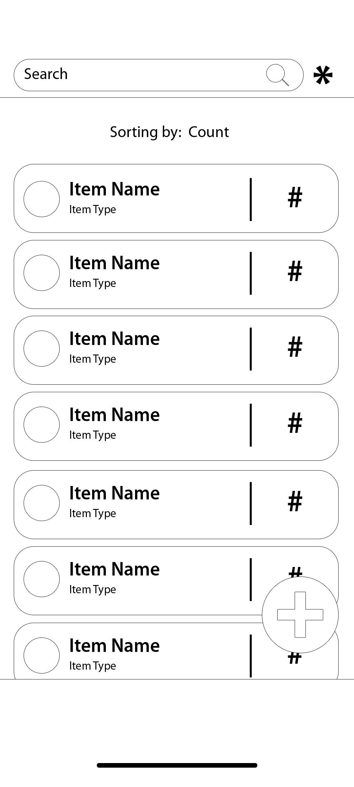
</p>

Next, I created a new, basic application using Android Studio. Once it was set up, I first began creating pertinent .xml files, one for the main activity, one for what each item would look like, and one for each bottom sheet that would be implemented.
<p align="center">
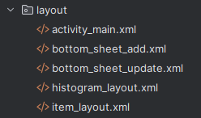
</p>
Once this was done, I simply created layouts using basic features so that I could easily access them when I was programming the main activity. As development continued, I slowly added more resource files and continued to develop the existent ones, adding new colors, layouts, icons, and more, including for day and night modes.

<br> Afterwards, coding and testing alternated, with any new features that required development being added. Use of Javadoc comments also helped to ensure more useful and explanatary coding.
<p align="center">
    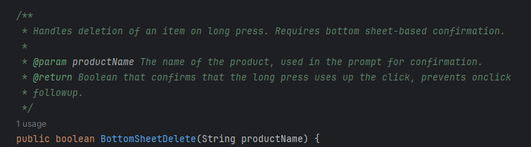
</p>
<p align="center">
    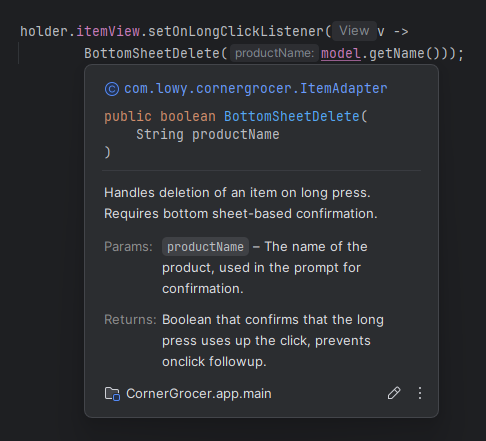
</p>

### The Features
While this enhancement is not a finalized version of the application, it does demonstrate the focus on Software Design and Engineering. As such, certain features have been updated or introduced. These include:

- **New GUI and layout, displaying all capabilities on one screen, with a scrollable RecyclerView that allows for quick, responsive access to all products**
<p align="center">
    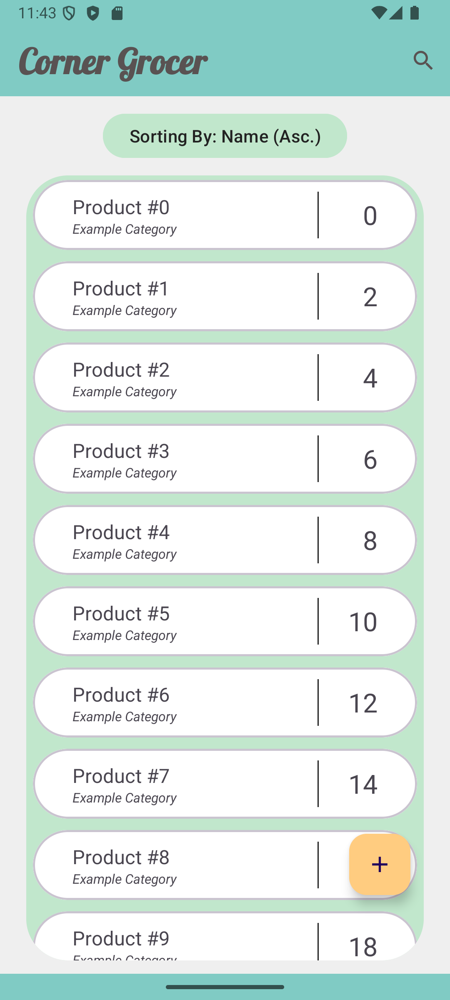
    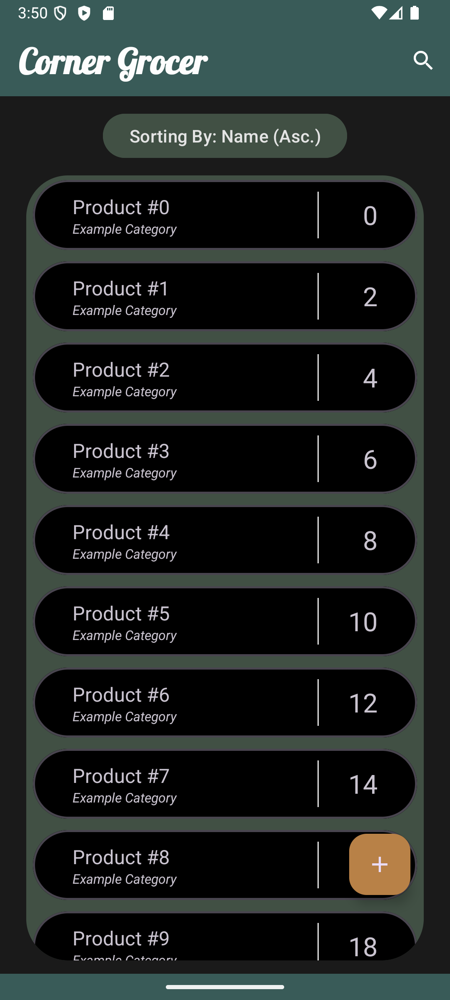
</p>
<br><br>

- **Search capabilities accessed directly from the toolbar**
<p align="center">
    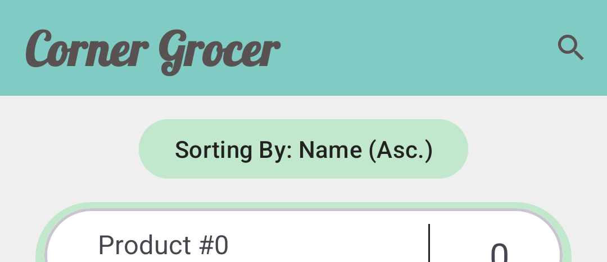
    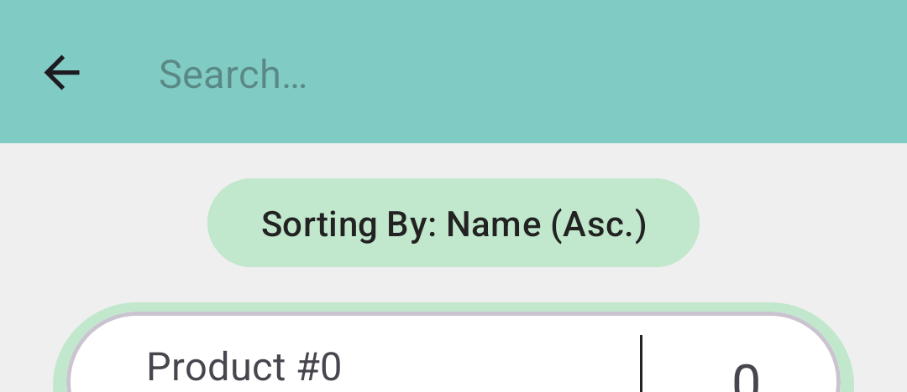
</p>
<br><br>

- **Adjusting products by clicking on individual items, with hint text displaying the currently set quantity, and a decrement button that is disabled should the quantity be at zero**
<p align="center">
    <!--  -->
    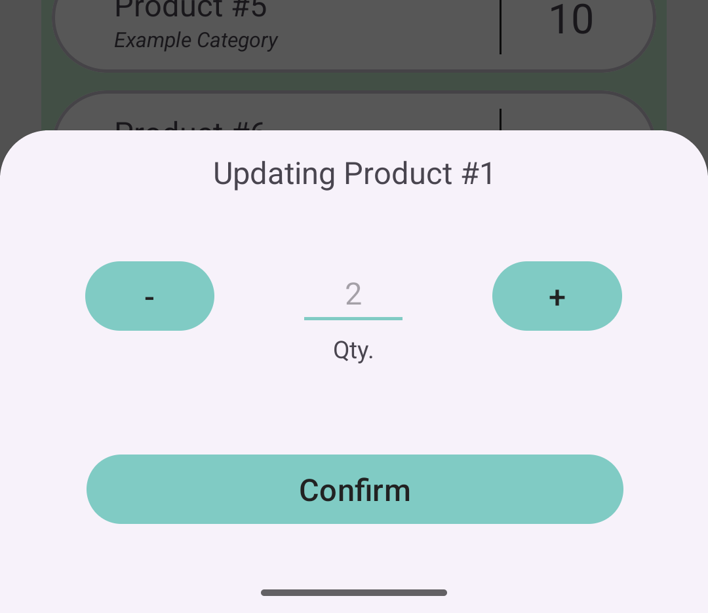
    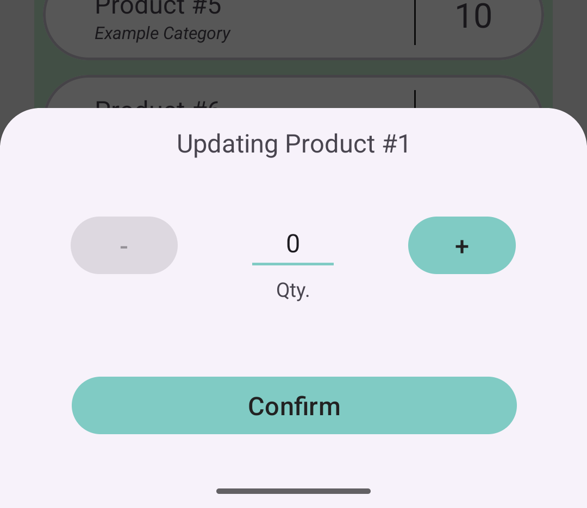
</p>
<br><br>

- **Adding new products upon clicking the floating action button**
<p align="center">
    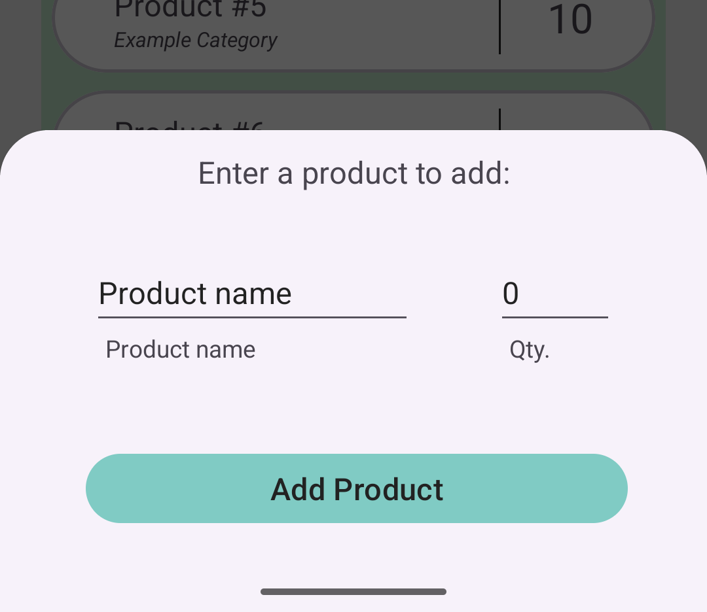
</p>
<br><br>

- **Deleting products upon long-press, which then requires confirmation**
<p align="center">
    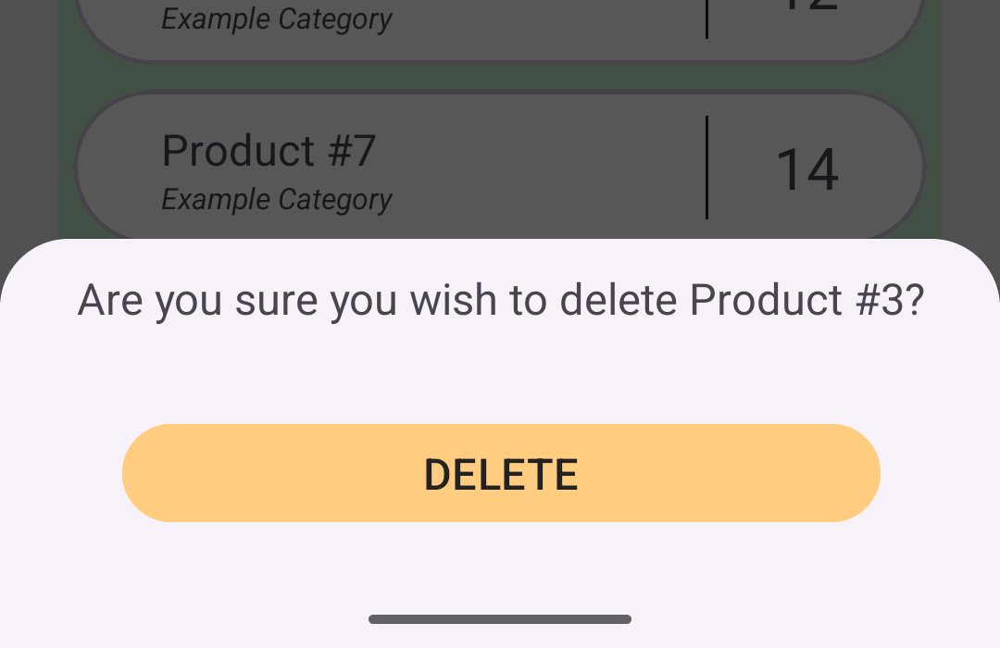
</p>

- **Optional histogram view through the overflow menu**
<p align="center">
    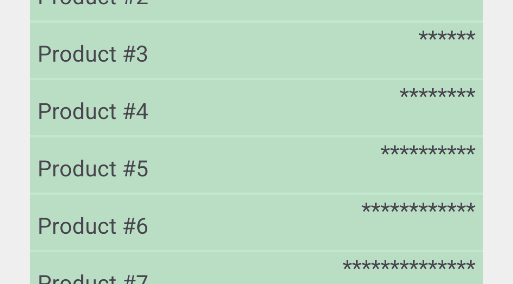
</p>

<br><br>

### The Narrative

>The artifact that I have chosen for enhancement is a project from CS 210 - Programming Languages. Initially a project designed to help learn class structures using C++, it was a simple application that tracked the number of items sold in a day by the Corner Grocer. Using data from a file, this information was shown to the user through three options: individual item search, displaying all items, and displaying all items through a histogram of asterisks for each item sold.<br><br>
I selected this project for multiple reasons. The main reason being that it is a simple enough application that it affords me the opportunity to adapt it to numerous environments and to make many improvements. In this case, I am adapting it to be a fully-fledged Android application that also allows users to add to or edit the items listed. This allows me to showcase user interface and user experience skills through developing a graphical user interface, as well allowing me to demonstrate my adaptability and consideration for future updates and enhancements. It also allows me to showcase Java proficiency, as well as an eye for detail and layout, as well as experience with databases such as SQL and SQLite as well as familiarity with data manipulation. <br><br>
For this enhancement, my goal primarily was to meet the fourth outcome, focusing on using well-founded and innovative techniques for implementing my solution to deliver value. By demonstrating that the application could run in a more visual and impactful manner, as well as being more accessible, I demonstrated adherence to this outcome. By using a consistent and meaningful commenting style through Javadoc comments, I allow for other developers, as well as myself, to more readily go through the code and understand how and why certain functions operate. I also have and will continue to maintain accessibility, in adherence to Android's design and accessibility principles. The methods and class structure implemented, as well as alternative versions of colors and icons for those devices using dark modes, follow best practices, with considerations towards current methodologies for development. I also followed a full plan to implement this enhancement, using requirements gathering, planning, mockup and wireframe design, alongside implementation and testing following a common development lifecycle. While there are features that check for valid input, these will be enhanced further in later updates once the database has been implemented, with algorithms and data structures also playing a large role in the input validation and error handling process. Currently, my outcome-coverage plans are intact, as I believe that, through the narratives, reflection, and code review, I will be covering the first two course outcomes, and the following enhancements will demonstrate a blend of the final three outcomes, with focus on the final two.<br><br>
Through the enhancement process, I have learned a lot. In particular, I have learned that practice truly does help: the first time that I created an Android application, I worried that the process would never quite "click into place" for me, and that I would constantly have to look up the entire procedure. However, when developing this application, I realized that I knew much more about the process than I had realized, and that I can now feel much more confident when tackling different aspects of application design and development. Using Android Studio's resources, designing an interface, and setting up the class and project structure was rather easy, and that knowledge has cemented my desire to continue working in application development. The most pressing challenge I faced was not to do with the actual development side, but the testing, as my computer needs to be replaced soon and struggles to run the Android emulator smoothly. My plan to rectify this is simple: replacing my computer once I graduate as a gift to myself. 
The other challenge I faced is trying to avoid perfecting every detail too early. As this enhancement will be polished after receiving feedback and modified during later enhancements, I had to try not to overwork small details. If I implemented every design consideration I wanted, the project would be behind schedule. Ideas such as offering a color selector for individual items, while helpful, are not necessary, and so I needed to be willing to push those developments and features back, focusing on what is necessary. This is a challenge for me, as I tend to be a perfectionist and enjoy working on developing user interface components and features. However, I am improving my ability to properly organize my time and development structure.

