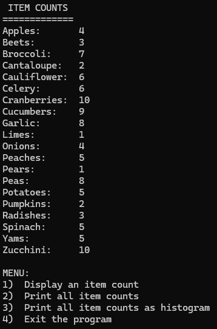
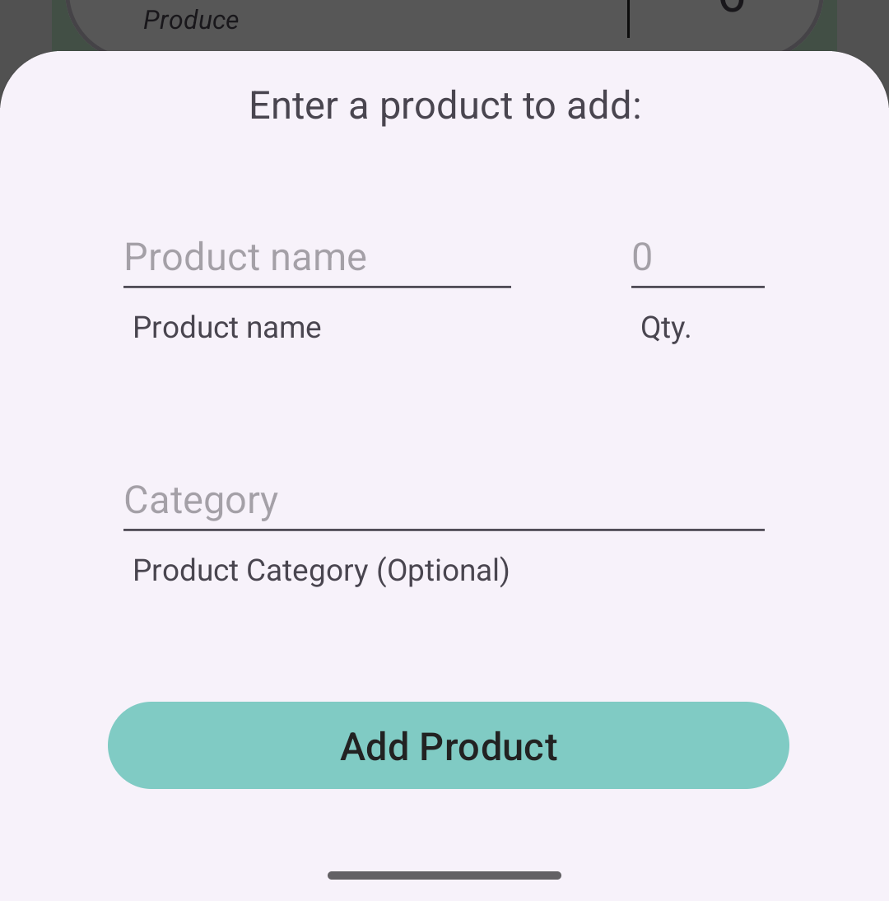
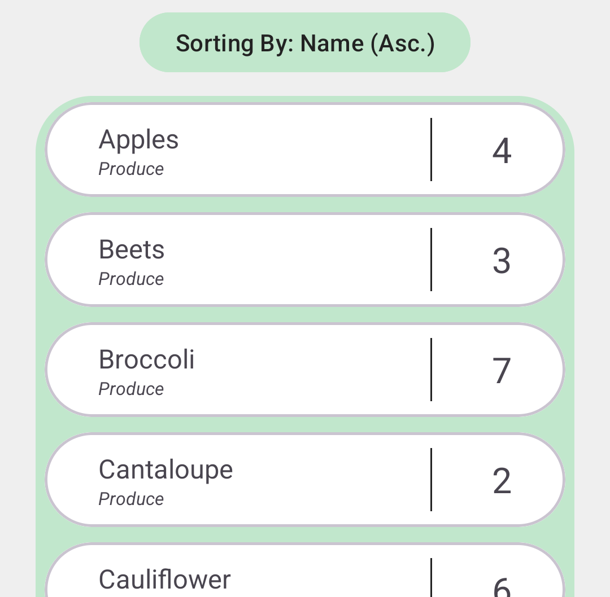

# Corner Grocery Application


## The Original Project
<details>
<summary>Click here to collapse/expand this section</summary>

### The Goal:
The final project for CS 210 - Programming Languages, a course that taught basic file and class structures using languages such as C++. The premise of the final project is as follows:
>"Your task is to build an item-tracking program for the Corner Grocer, which should incorporate all of their requested functionality. The Corner Grocer needs a program that analyzes the text records they generate throughout the day. These records list items purchased in chronological order from the time the store opens to the time it closes. They are interested in rearranging their produce section and need to know how often items are purchased so they can create the most effective layout for their customers."

The file given was a basic .txt file with the item names written, separated by line, in order that they were purchased. An example is below:
```
Spinach
Radishes
Broccoli
Peas
Cranberries
Broccoli
```
From this snippet, we can see that there are two listings for Broccoli, so Broccoli should have a count of two so far. 


### The Artifact:
The artifact was a simple C++ application that ran in a terminal window. It included four options, chosen by typing a number and pressing enter: display a single item's count, display all items and their counts, display all items and their counts as a histogram, and exit.

<p align="center">
    
</p>

When options two and three are selected:

<p align="center">
    
    
</p>
<br><br>

### The Code Review
Clicking on the thumbnail below will take you to the video hosted on Youtube:

<div align="center">
  
[](https://www.youtube.com/watch?v=Jh8hhmw8C44)

</div>

</details>

<br>

## Enhancement Three - Databases
Note, **Enhancement Three - Databases** was implemented prior to **Enhancment Two - Aglorithms & Data Structures**. This is due to easier implementation of algorithms/data structures thanks to stored and consistent inputs/outputs thanks to the SQLite database. However, there is also some overlap in these two enhancements, as algorithms and data structures do play a significant role in setting up, populating, and accessing a database.


### The Process
To begin, the main goal of implementing a database was to have repeat access to data with improved ability to search, sort, and modify. To that end, the first task was implementing a SQLite database. However, instead of using the default Android implementation of SQLite and related libraries, I instead used SQLCipher, so that a more secure database can be encrypted and require a passkey to decrypt it. This allows, should the Corner Grocer desire, an added level of security. While the application itself stores the database in a private folder in the system accessible only to the application, it now includes an added layer of protection. Another step of security is preventing SQL injection. This is accomplished in numerous ways, including the use of parameterized queries for user input, content values for helper methods, and limiting lengths and types of user input. 

### The Features
As seen in earlier screenshots, there were placeholders for adding, updating, and deleting entries. These have now been given full functionality, allowing for users to completely modify the data stored within the database and shown in the application's main screen. Adjustments have also been made to allow users to submit an optional category for any item when adding.
<p align="center">
    
</p>
<br>

There is also another significant change. When first launched, or when the database is removed when clearing the application storage, the application will build the SQLite database based on the input text file. This file has been modified for the Android application to include the data in this format: `Name,Category,Quantity`. An example portion of the input file and resulting main screen are below.

```
Apples,Produce,4
Beets,Produce,3
Broccoli,Produce,7
Cantaloupe,Produce,2
Cauliflower,Produce,6
```

<p align="center">
    
</p>
<br>

Additional features include case insensitivity and trimmed inputs, so attempting to add ` yAMS     ` while `Yams` has already been entered will let you know that it is already in the database. This can help prevent issues with repeat items, especially in cases where users may accidentally attempt adding an existing item with differing capitalization or add a space after entering a product name due to keyboard suggestions.

Other, minor fixes have been added in this enhancement as well, including improved enabling/disabling of buttons when certain conditions are met, such as the increment button being disabled to begin with when the item chosen for updating began with the maximum quantity. 

### The Narrative

>The artifact that I chose for this enhancement, as well as the other two, is from CS 210 - Programming Languages. In it, a grocery store, Corner Grocer, requested an application that reads information from a file to display the sale of items in three ways: by search, displaying all, or displaying all with a histogram. The data is also saved in a different format to a file called frequency.dat. The reason that I chose this artifact is that it works very well with the three enhancements, as it is a simple, yet useful original application that has room for improvement, and already shows a need for a more robust data management system. However, it should be noted that at this stage, I have alternated the order of enhancements and have worked on the Database enhancement prior to the Algorithm and Data Structure enhancement.<br><br>
In this specific enhancement category, adding a proper database allows for improved speed and data manipulation. It also allows the application to gain a level of security and input validation that would otherwise be a much more complex operation. To that end, I have implemented a SQLite database through SQLCipher, which allows for encrypting and decrypting the database should Corner Grocer desire. There is also functionality for reading, creating, updating, and deleting entries, as these can often be necessary when reviewing inventory, and allow for correcting any mistakes in the initial data files. This enhancement allows me to demonstrate an understanding of the implementation of relational databases and associated functionality, while writing code that allows for effective and easier future updates. This can be seen in the addition of a column in the database for product categories, which, while not necessary, allows for improved data effectiveness and manipulation.<br><br>
The course outcome that was a specific focus of this enhancement was the final outcome: "Develop a security mindset that anticipates adversarial exploits in software architecture and designs to expose potential vulnerabilities, mitigate design flaws, and ensure privacy and enhanced security of data and resources." This outcome was met through various means implemented, including a more secure format for data storage through using a database, optional encryption and decryption using a passphrase with SQLCipher, parameterized queries with user input validation to prevent injection, and having the data stored in a private encrypted folder accessible only to the application within the Android ecosystem. Such measures allow for a vastly improved level of security over the initial C++ program that uses an unencrypted directory to load, run, and store data in plain text formats.<br><br>
As of now, my outcome-coverage plans are intact. The initial enhancement focused on the fourth outcome: "Demonstrate an ability to use well-founded and innovative techniques, skills, and tools in computing practices for the purpose of implementing computer solutions that deliver value and accomplish industry-specific goals." This was accomplished through careful attention to the usage of various tools such as Javadoc commenting and by following well-founded guidelines for development such as accessibility and aesthetic considerations. Through the updated README markdown file, narratives, and code review, as well as through incorporating feedback into my work, I have also achieved, and will continue to meet, the first two course outcomes: "Employ strategies for building collaborative environments that enable diverse audiences to support organizational decision making in the field of computer science" and "Design, develop, and deliver professional-quality oral, written, and visual communications that are coherent, technically sound, and appropriately adapted to specific audiences and contexts." The remaining course outcome, “Design and evaluate computing solutions that solve a given problem using algorithmic principles and computer science practices and standards appropriate to its solution, while managing the trade-offs involved in design choices,” should be met through my upcoming enhancement for algorithms and data structure.<br><br>

For this artifact, there was a somewhat large learning curve in a few areas. First, I needed to learn how to better adapt the database and relevant operations to incorporate a more security-minded approach. This meant researching modern security concerns and solutions, as well as discovering tools to aid in the process. I then had to learn and test implementing those solutions and tools into my workflow, with additional tests to ensure that they provided ample security. Secondly, I needed to learn ideal techniques for displaying updated data, so that changes to the database were reflected in the application in an efficient manner. However, through testing solutions for both challenges, I gained an ability to solve them with a much deeper understanding of how to do so, which will aid me in my current and future projects.
