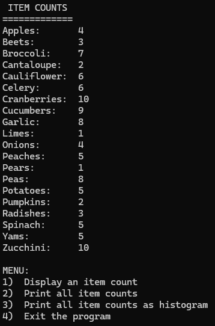

# Corner Grocery Application

## Note:
This is neither the final version of the project, nor of this README file. Updates will continue to be detailed as the project progresses. 

## The Original Project
<details>
<summary>Click here to collapse/expand this section</summary>

### The Goal:
The final project for CS 210 - Programming Languages, a course that taught basic file and class structures using languages such as C++. The premise of the final project is as follows:
>"Your task is to build an item-tracking program for the Corner Grocer, which should incorporate all of their requested functionality. The Corner Grocer needs a program that analyzes the text records they generate throughout the day. These records list items purchased in chronological order from the time the store opens to the time it closes. They are interested in rearranging their produce section and need to know how often items are purchased so they can create the most effective layout for their customers."

The file given was a basic .txt file with the item names written, separated by line, in order that they were purchased. An example is below:
```
Spinach
Radishes
Broccoli
Peas
Cranberries
Broccoli
```
From this snippet, we can see that there are two listings for Broccoli, so Broccoli should have a count of two so far. 


### The Artifact:
The artifact was a simple C++ application that ran in a terminal window. It included four options, chosen by typing a number and pressing enter: display a single item's count, display all items and their counts, display all items and their counts as a histogram, and exit.

<p align="center">
    
</p>

When options two and three are selected:

<p align="center">
    
    
</p>
<br><br>

### The Code Review
Clicking on the thumbnail below will take you to the video hosted on Youtube:

<div align="center">
  
[](https://www.youtube.com/watch?v=Jh8hhmw8C44)

</div>

</details>

<br>

## Enhancement Two - Algorithms & Data Structure

### The Goal:
To demonstrate competency in the course outcomes for CS 499 - Computer Science Capstone, I wanted to take the original artifact and demonstrate an ability to adapt it to other languages and systems, and to improve upon its functionality. To that end, the goal was to take the original artifact and recreate it as a fully-fledged Android application, using best practices and demonstrating an eye for user interface and user experience design, as well as an understanding of how to develop it to be update-friendly should new features be requested. As such, the final version should incorporate a large change of aesthetics including implementation of a graphical user interface, as well as implementations of new data structures, algorithms, engineering, and a SQLite database.


Note: This enhancement follows **Enhancement Three - Databases**, as it largely focuses on manipulating the data from that enhancement.

<summary>Click here to expand/collapse this section</summary>
For this enhancement, the application includes sorting based on different attributes, including by name, quantity, and product category in ascending and descending orders. Searching has also been implemented, allowing users to peruse data as effectively as possible, and while maintaining the current sorting method. These enhancements also function with the toggleable histogram. This is also the enhancement in which code is cleaned up, exessive variables, calls, or other aspects are removed or optimized, and other minor improvements are made.

### The Process
Using the data stored in the SQLite database previously, work on this enhancement began with modifying the database handler class to become a Singleton, as it only needs one instance, which also allows for both the main activity and adapter to communicate with it simulteanously. This allows for calls from either to utilize the same attributes in the handler class, namely the sorting method of SQL's ORDER BY statement. Because of this, any updates on either end can utilize the sorting method so that the user experience is consistent and intuitive. <a href="screenshots/cropped/IndexUsage.png">An index was created for the name column in the table to allow faster ordering.</a><br>
The next step was implementing searching, which involved modifying the adapter class in particular to take in a filtered list, which was acquired through the main activity's SearchView calling for an updated list whenever the text was modified. This required some moderate changes to the way the RecyclerView received new data, and how it updates. For efficiency, updates and deletions no longer reload the entire database's table's contents, but instead update the single item modified or deleted. 

### The Features
The most noticeable features incorporated are the search and sort functions.

- **Sorting**

To allow for improved readability and utility, the easy to see and access "Sorting By" button updates on each click, allowing users to see the data in their preferred order. This includes by name, quantity, and category, each with ascending and descending options. Note that the initial database, created from an input file, did not contain any categories except for "Produce". 
<p align="center">
    
    
    
    
    
    
</p>
<br><br>

- **Searching**

This enhancement implements the SearchView to allow users to search for results quickly. You may notice that the sorting option is disabled during this process; this is so that the search maintains the current sorting order, and it is enabled again once the search is complete.
<p align="center">
    
</p>
<br><br>

#### The Narrative

>For this enhancement, I have continued my work on the Corner Grocer Android application based on the CS 210 - Programming Languages C++ project. In the project, a file was read from input that contained the items purchased at the Corner Grocer. The initial artifact allowed users to search for a specific item, display all items, and display all items as a histogram. As a simple project, it allowed me the flexibility to adapt it into a new language with new features while retaining its core goals. For algorithms and data structures, it allowed me to manipulate data more effectively, and to demonstrate methods of data handling that improve speed and utility, such as through sorting and searching methods, while also allowing easier modifications in the event of additional information being required or desired. Because I performed the database enhancement first, I was then able to utilize the information within the database to quickly construct and sort different lists, add new columns of information, and apply filters to aid users. This enabled me to demonstrate an understanding of best practices when evaluating and implementing solutions for data structuring and management.<br><br>
With this enhancement, I completed my final outcome, which is the third in the list, relating to designing and evaluating computing solutions to solve problems using algorithmic principles and practices while managing trade-offs. One example of this is the use of indexing for the SQLite database to allow faster read operations. While the use of many indexes within a large write-heavy database may see significant slowdowns, at the size and operation assumed by the initial artifact prompt any potential slowdown would be unnoticeable, and the use of write operations will be much less than read operations. This allows faster reading and sorting than without an index, with no perceptible trade-off. With the index, the time complexity of a search may be O(log n), as opposed to the standard O(n). Such considerations allow the program to run in an efficient manner, meeting user needs and allowing greater flexibility in how data is read and interpretted. With this enhancement, my course outcomes are completed, though there are still more opportunities to demonstrate adherence to them, such as through the professional self-assessment.<br><br>
Throughout this stage of enhancements, I learned the importance of carefully weighing my options with regard to solutions and practices. While the provided input file contains only twenty items, it is important to consider how the application would handle much larger amounts of data. Though the initial input may be small, with the newly implemented ability to add items solutions that have almost no perceptible slowdowns may cause severe issues with more data. Therefore, I had to do a lot of research into modern solutions and their trade-offs before implementing any. I also had to learn to better use tools for testing data, such as through Android Studio's app inspection window to manage and query data, evaluate query plans, and ensure that solutions such as the created index were being utilized in any appropriate scenarios. 
